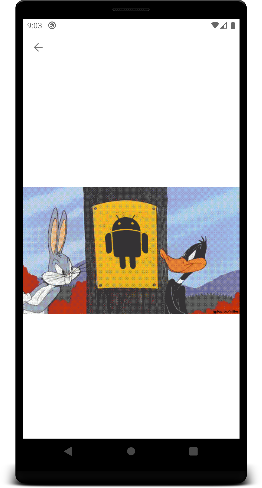

# README #

This project will show you gif's or stickers using GIPHY API.

### What is this repository for? ###

* Quick summary
It's used to search the gif & stickers from GIPHY api's
* Version
1.0.0
* [Learn Markdown](https://bitbucket.org/tutorials/markdowndemo)

 

| Search | Browse | Details |
| ------ | ----- | ------ |
|  |  |  |

 
### How do I get set up? ###

Import directly into android studio version 2020.3.1 Arctic fox and above

* Dependencies
    1. AndroidX         --> Done
    2. Hilt             --> Done
    3. ViewModel        --> Done
    4. Coroutines       --> Done
    5. Retrofit         --> Done
    6. Gson             --> Done
    7. GIPHY Lib        --> Done
    8. Paging           --> Done
    9. Navigation Lib   --> Done